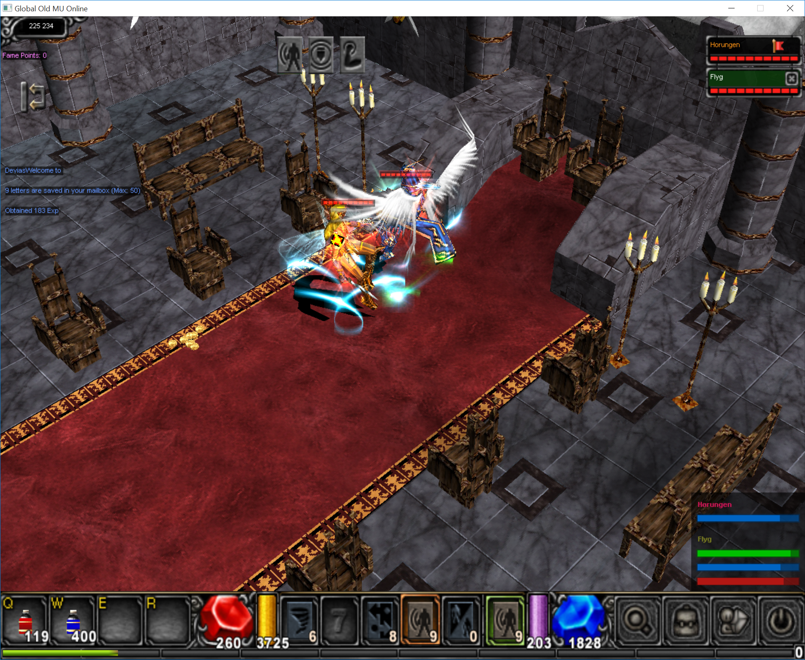

# MuTool

This is a Mu Online cheat/tool implemented in Rust for protocol version 1.02d.

The program uses hard-coded offsets so it's only applicable for a specific
binary version. The obvious improvement would be a signature scanner, but I
stopped playing before it became relevant.

## Features

Many of these are used as complement to standard botting.

- Auto Health Potion
- Auto Repair
- Buff Timer (GUI)
- Death Notifer (Screenshot & Pushbullet)
- Loot Filter (when using `<space>`)
- Loot Notifier (Pushbullet)
- User Stats (XP, DPS, Kills, money)


### Implementation

The tool analyzes incoming packets by detouring `ProtoCore`, the main packet
handler. GUI rendering is done by using the game's implementation. All
information regarding the client was obtained by reverse engineering the Mu
Online client using IDA Pro, extracting protocol packets and functons of
interest.

### Loot Pattern

The loot notifier & filter uses a PEG parser for item patterns.

```
[X] [Item] [[<>=]level][[<>=]option][+S][+L]
```

### Buff Timer



*NOTE: Disregard my little brother's profanity...*